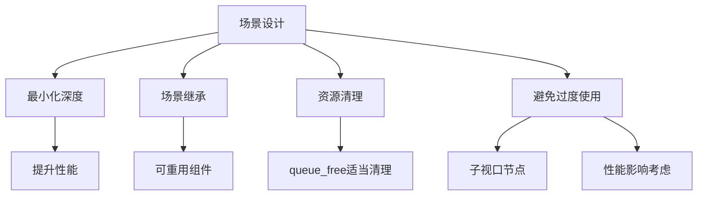
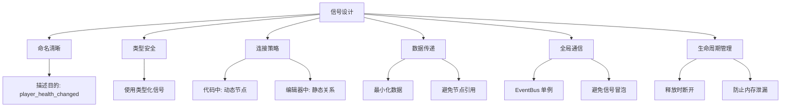
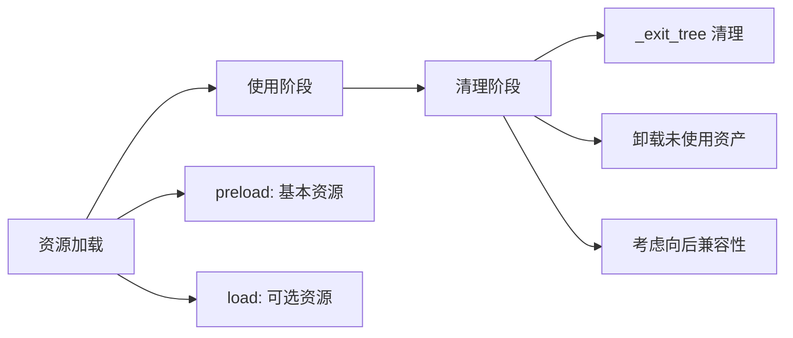
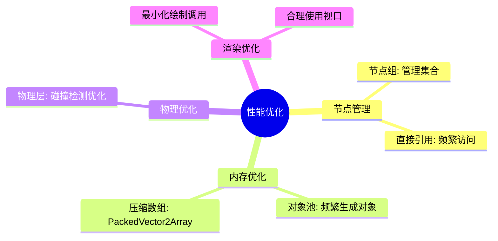
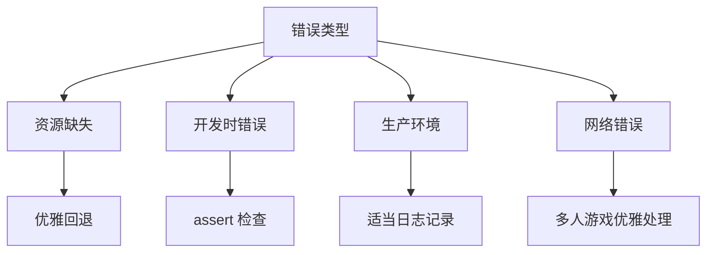
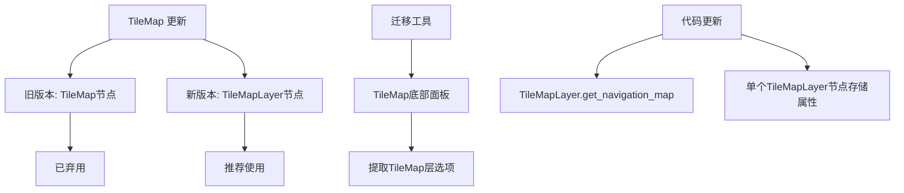

# CLAUDE.md

This file provides guidance to Claude Code (claude.ai/code) when working with code in this repository.

## Project Overview

**Geometry Survivor** is a Godot 4.5 top-down survival game with modular equipment systems, buff mechanics, and meta-progression through a safe house system.

## Core Architecture

### Module Structure (5-layer architecture)
```
Layer 1: globals/          - Core services (EventBus, GameManager, Constants)
Layer 2: entities/         - Game entities (Player, Enemies, Buffs)
Layer 3: equipment/        - Weapons, armor, mods, hit effects
Layer 4: ui/              - User interface components
Layer 5: scenes/          - Scene organization and prefabs
```

### Key Systems

**Event System**: Uses FightEventBus for decoupled communication between modules
- `on_projectile_kill`, `on_equipment_used`, `on_player_damage`, etc.

**Equipment System**: Modular weapon/armor system with
- Base classes: `equipment_base.gd`, `equipment_resource.gd`
- Emitters: `emitter_equipment_base.gd` for ranged weapons
- Armor: `armor_equipment_base.gd` for defensive gear
- Mods: Event-driven enhancement system (see equipment/mod/README.md)

**Buff System**: Status effect framework
- `buff_manager.gd` handles buff application/removal
- Effect types: attribute modifiers, DoT, control effects

**Safe House**: Meta-progression hub with 6 rooms
- Battle, Brand, Main, Recruit, Research, Upgrade rooms
- Managed by `safe_house_manager.gd`

## Development Commands

### Godot CLI Commands
```bash
# Run the game
godot --path /Users/xiechuyu/code/godot/geometry-survivor/

# Run specific scene
godot --path /Users/xiechuyu/code/godot/geometry-survivor/ src/fight/fight.tscn

# Export (if configured)
godot --path /Users/xiechuyu/code/godot/geometry-survivor/ --export-release "Windows Desktop" build/
```

### Debug & Testing
```bash
# Enable verbose logging
godot --verbose --path /Users/xiechuyu/code/godot/geometry-survivor/

# Run with debug collision shapes visible
godot --debug-collisions --path /Users/xiechuyu/code/godot/geometry-survivor/

# Profile performance
godot --profile-gpu --path /Users/xiechuyu/code/godot/geometry-survivor/
```

### Common Development Tasks

**Adding New Equipment**:
1. Create equipment class inheriting from appropriate base
2. Define resource in `equipment/{type}/resources/`
3. Add to equipment manager if needed

**Creating New Mods**:
1. Define trigger in `equipment/mod/triggers/`
2. Define effect in `equipment/mod/effects/`
3. Create mod resource combining trigger + effect
4. Test via ModManager API

**Adding Buffs**:
1. Create buff effect in `entities/buff/effects/`
2. Define buff resource in `entities/buff/resources/`
3. Reference from equipment mods or direct application

## File Patterns

- `.gd` - GDScript files (main logic)
- `.tres` - Resource files (config/data)
- `.tscn` - Scene files (Godot scenes)
- `.uid` - Unique identifiers (auto-generated)

## Key Entry Points

- **Game Entry**: `src/fight/fight.tscn` (main scene)
- **Safe House**: `src/safe_house/safe_house.tscn`
- **Player**: `src/entities/player/player.tscn`
- **Equipment Manager**: `src/equipment/equipment_manager.gd`

## Module Communication

All inter-module communication happens through:
1. **EventBus** (`src/fight/global/event_bus.gd`) - Global events
2. **FightEventBus** (`src/fight/global/fight_event_bus.gd`) - Combat events
3. **Direct references** within same layer (entities ↔ equipment)

## Configuration Files

- `project.godot` - Engine configuration
- `src/globals/constants.gd` - Game constants
- Equipment/buff/mod resources in respective `resources/` folders

## 🎯 项目概述

- **引擎版本**：Godot 4.5
- **编程语言**：GDScript
- **文档位置**：Curor Doc 中的godot
- **原则**：需求不明确时，请先要求用户补充完善

总规则：
- 总是用中文回复。
- 在开发新功能前，先不开发代码而是分析现有代码，并判断需求是否合理或者存在模糊不清的地方。整理完成，与用户确认下一步方案。开发方案需要扩展性强，同时代码、架构简洁避免过度设计。

文档规则：
- 在编辑文档时避免写代码块。

编码规则：
- 避免单个文件内多个模块过度耦合，保持最小职责原则。
- 开发新功能时请考虑是否在新的文件中实现。
- 在开发新函数后，尽可能使用 doc comment 描述函数功能。
- 避免单个函数过长，如果函数过长，请考虑拆分函数。
- 避免逐行注释，每个代码块总结性注释一次

编码规则：
- 避免单个文件内多个模块过度耦合，保持最小职责原则。
- 开发新功能时请考虑是否在新的文件中实现。
- 在开发新函数后，尽可能使用 doc comment 描述函数功能。
- 避免单个函数过长，如果函数过长，请考虑拆分函数。
- 避免逐行注释，每个代码块总结性注释一次

## 📝 代码规范

### 基础规范

1. **缩进规范**：统一使用 Tab 缩进
2. **文档注释**：新函数需添加文档注释
   - 每一行结束需要使用 `[br]` 换行
   - 注释中的代码块使用 `[codeblock][/codeblock]` 包围
   - 格式参考：`refer/开发文档/godot 4.4/tutorials/scripting/gdscript/gdscript_documentation_comments.rst.txt`
3. **注释原则**：注释适度，以代码块总结为主，避免逐行注释

### 编程最佳实践

- 在 GDScript 中使用严格类型，以获得更好的错误检测和 IDE 支持
- 使用显式的 `super()` 调用实现 `_ready()` 和其他生命周期函数
- 在 `_ready()` 中使用 `@onready` 注释而不是直接节点引用
- 在可能的情况下，更喜欢组合而不是继承
- 使用信号实现节点之间的松耦合
- 遵循 Godot 的节点命名约定（PascalCase 用于节点，snake_case 用于方法）
- $NodePath等效于get_node("NodePath"), %UniqueNode等效于get_node("%UniqueNode")。一般使用$获取节点引用

---

## 🎨 代码样式

### 基本要求

- 对所有变量和函数参数使用类型提示
- 使用文档字符串记录复杂函数
- 保持方法集中，尽可能在 30 行以内
- 使用有意义的变量和函数名
- 将相关属性和方法组合在一起
- 便好组合，不要过度封装
- 使用Time.get_ticks_msec()获取时间戳
- 避免使用preload/load加载依赖，而是通过 class_name 将类注册为 global class 后直接引用

---

## 📋 命名约定

### 文件与类命名

| 类型     | 规范                       | 示例                                    |
| -------- | -------------------------- | --------------------------------------- |
| **文件** | snake_case                 | `player_character.gd`, `main_menu.tscn` |
| **类**   | PascalCase (带 class_name) | `PlayerCharacter`                       |
| **节点** | PascalCase (场景树中)      | `PlayerCharacter`, `MainCamera`         |

### 变量与函数命名

| 类型     | 规范                | 示例                               |
| -------- | ------------------- | ---------------------------------- |
| **变量** | snake_case          | `health_points`                    |
| **常量** | ALL_CAPS_SNAKE_CASE | `MAX_HEALTH`                       |
| **函数** | snake_case          | `move_player()`                    |
| **信号** | 过去时 snake_case   | `health_deleted`, `enemy_defeated` |

### 枚举命名

- **枚举类型**：PascalCase
- **枚举值**：ALL_CAPS_SNAKE_CASE

---

## 🏗️ 场景组织

### 组织原则



### 实施要点

- 保持场景树深度最小，以获得更好的性能
- 对可重用组件使用场景继承
- 对 `queue_free()` 执行适当的场景清理
- 由于性能影响，请谨慎使用子视口节点
- 提供创建 Godot 场景的分步说明，而不是提供场景源代码

---

## 📡 信号最佳实践

### 信号设计流程



### 具体规范

- **命名**：使用清晰的上下文信号名称来描述其目的（例如：`player_health_changed`）
- **类型化**：利用键入的信号来提高安全性和 IDE 辅助（例如：`signal item_collected(item_name: String)`）
- **连接策略**：
  - 在代码中为动态节点连接信号
  - 在编辑器中为静态关系连接信号
- **使用原则**：
  - 避免过度使用信号——将其保留用于重要事件，而不是频繁更新
  - 仅通过信号参数传递必要的数据，尽可能避免整个节点引用
- **全局通信**：对于需要到达远程节点的全局信号，使用自动加载的 "EventBus" 单例
- **性能优化**：尽量减少通过多个父节点的信号冒泡
- **内存管理**：释放节点时始终断开信号，以防止内存泄漏
- **文档化**：记录带有注释的信号，解释其目的和参数

---

## 🗂️ 资源管理

### 资源生命周期



### 管理要点

- 在 `_exit_tree()` 中实现适当的资源清理
- 对基本资源使用 `preload()`，对可选资源使用 `load()`
- 考虑 `PackedByteArray` 存储对向后兼容性的影响
- 对未使用的资产实施资源卸载

---

## ⚡ 性能最佳实践

### 优化策略



### 具体实践

- 明智地使用节点组来管理集合，并更喜欢直接引用节点以频繁、特定地访问单个节点
- 为频繁生成的对象实现对象池
- 使用物理层优化碰撞检测
- 与常规数组相比，更喜欢压缩数组（`PackedVector2Array` 等）

---

## 🛡️ 错误处理

### 错误处理策略



### 处理原则

- 为缺失的资源实现优雅的回退
- 使用 `assert()` 进行开发时错误检查
- 在生产构建中适当记录错误
- 在多人游戏中优雅地处理网络错误

---

## 🗺️ TileMap 实现

### 版本迁移



### 实施要点

- **废弃说明**：TileMap 节点已弃用 - 改用多个 TileMapLayer 节点
- **迁移方法**：使用 TileMap 底部面板工具箱选项"提取 TileMap 层"转换现有的 TileMap
- **访问方式**：通过 TileMapLayer 节点访问 TileMap 层
- **代码更新**：更新导航代码以使用 `TileMapLayer.get_navigation_map()`
- **属性存储**：在单个 TileMapLayer 节点上存储特定于层的属性
