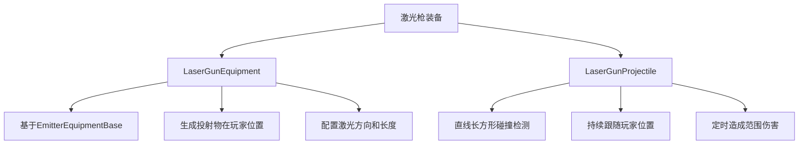
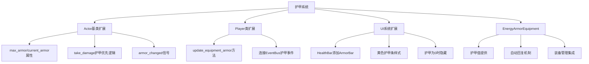
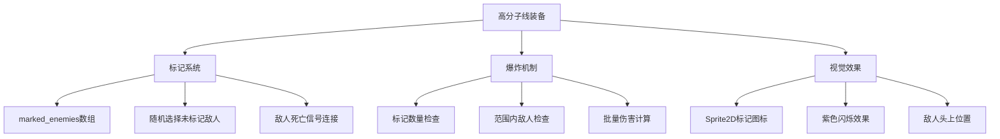

# 新装备实现总结

本文档总结了三个新装备的实现：激光枪、电能护甲和高分子线。

## 🔫 激光枪装备

### 功能特性
- **基础实现**: 基于fist装备架构，继承EmitterEquipmentBase
- **目标选择**: 自动瞄准攻击范围内生命值最低的敌人
- **攻击方式**: 直线长方形激光柱，同时攻击范围内所有敌人
- **持续伤害**: 激光柱存在0.5秒，每0.08秒造成5点能量伤害
- **视觉效果**: 使用icon.svg作为纹理，青色调，带缩放和外发光

### 技术实现

### 文件结构
- `src/equipment/emitter/laser_gun/emitter/laser_gun_equipment.gd`
- `src/equipment/emitter/laser_gun/projectile/laser_gun_projectile.gd`
- 对应的.tscn和.tres资源文件

## 🛡️ 电能护甲装备

### 功能特性
- **护甲系统**: 扩展Actor基类，添加护甲机制
- **伤害优先级**: 护甲优先于生命值消耗
- **自动回复**: 护甲破碎后2秒开始回复，每0.2秒回复5点
- **装备槽占用**: 作为装备槽装备，可装备/卸载
- **UI显示**: 扩展健康条显示黄色护甲条

### 技术实现

### 文件结构
- `src/entities/actor.gd` - 护甲系统基础
- `src/entities/player/player.gd` - 玩家护甲管理
- `src/globals/event_bus.gd` - 护甲事件
- `src/ui/health_bar.gd` - UI显示
- `src/equipment/armor/energy_armor_equipment.gd` - 护甲装备

## ⚡ 高分子线装备

### 功能特性
- **标记机制**: 标记攻击范围内的随机敌人
- **延迟爆炸**: 标记数量>5或无其他敌人时触发爆炸
- **高额伤害**: 爆炸造成75点能量伤害
- **视觉效果**: 敌人头上显示紫色闪烁标记图标
- **智能清理**: 敌人死亡时自动移除标记

### 技术实现

### 文件结构
- `src/equipment/emitter/polymer_wire/emitter/polymer_wire_equipment.gd`
- 对应的.tscn和.tres资源文件

## 🔧 系统集成

### 装备管理器集成
所有新装备都已添加到`equipment_manager.gd`的fallback_paths中，可以自动加载和使用。

### 事件系统
- 护甲系统完全集成到EventBus
- 伤害系统支持护甲优先消耗
- UI实时响应护甲变化

### 视觉反馈
- 激光枪：直线激光束效果
- 电能护甲：黄色护甲条
- 高分子线：紫色闪烁标记

## 🎯 测试建议

1. **激光枪测试**
   - 验证激光方向是否正确指向最低生命值敌人
   - 确认持续伤害机制正常工作
   - 检查视觉效果是否正确显示

2. **电能护甲测试**
   - 验证护甲优先消耗机制
   - 测试护甲回复系统
   - 确认UI显示正确

3. **高分子线测试**
   - 验证标记机制和随机性
   - 测试爆炸触发条件
   - 确认敌人死亡时标记清理

## 📈 性能考虑

- 激光枪：持续碰撞检测，需要优化碰撞查询
- 电能护甲：定时器系统，影响较小
- 高分子线：敌人列表遍历，大量敌人时需要优化

## 🔄 未来扩展

1. **Buff系统**: 为高分子线的标记机制提供更完善的buff框架
2. **护甲类型**: 支持不同类型的护甲（物理、魔法等）
3. **装备升级**: 为所有装备添加升级机制
4. **视觉效果**: 更丰富的粒子效果和动画

---

所有三个装备已成功实现并集成到游戏系统中，可以通过装备管理器进行测试和使用。 