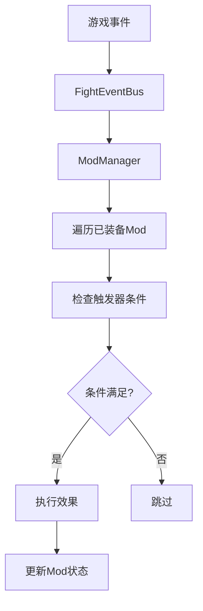

# Mod系统

## 概述

Mod系统是一个事件驱动的装备强化系统，通过组合不同的"触发器"和"效果"来创建丰富多样的Mod。

## 系统架构

### 核心组件

1. **ModManager** - Mod管理器
   - 负责监听FightEventBus事件
   - 管理已装备的Mod
   - 处理Mod的触发和效果执行
   - 支持在编辑器中配置默认Mod

2. **ModResource** - Mod资源
   - 定义Mod的基本信息（名称、描述、稀有度等）
   - 包含触发器和效果的引用
   - 管理冷却时间和触发次数限制

3. **TriggerResource** - 触发器基类
   - 定义Mod的触发条件
   - 所有具体触发器的基类

4. **EffectResource** - 效果基类
   - 定义Mod触发后的效果
   - 所有具体效果的基类

### 工作流程



## 已实现的触发器

### TriggerKills - 击杀触发器
- **功能**: 每击杀指定数量的敌人时触发
- **配置参数**:
  - `required_kills`: 所需击杀数量
  - `use_consecutive_kills`: 是否使用连续击杀模式
  - `reset_on_damage`: 受到伤害时是否重置计数

### TriggerEquipmentUse - 装备使用触发器
- **功能**: 特定装备使用指定次数后触发
- **配置参数**:
  - `required_uses`: 所需使用次数
  - `target_equipment_class`: 目标装备类名（空字符串表示任意装备）
  - `reset_on_cooldown`: 装备进入冷却时是否重置计数

## 已实现的效果

### EffectApplyBuff - 应用Buff效果
- **功能**: 给目标添加指定的Buff
- **配置参数**:
  - `buff_resource`: 要应用的Buff资源
  - `override_duration`: 覆盖持续时间
  - `buff_stacks`: 应用的Buff层数
  - `apply_to_self`: 应用到自己（玩家）
  - `apply_to_target`: 应用到目标

### EffectSpawnProjectile - 生成投射物效果
- **功能**: 在指定位置生成投射物
- **配置参数**:
  - `projectile_resource`: 投射物资源
  - `spawn_count`: 生成数量
  - `spawn_spread`: 生成扩散角度
  - `spawn_at_player`: 在玩家位置生成
  - `target_nearest_enemy`: 瞄准最近的敌人

## 使用示例

### 创建击杀治疗Mod

1. **创建触发器资源** (`test_kill_trigger.tres`)
```gdscript
[gd_resource type="TriggerKills"]
required_kills = 5
use_consecutive_kills = false
reset_on_damage = false
```

2. **创建效果资源** (`test_heal_effect.tres`)
```gdscript
[gd_resource type="EffectApplyBuff"]
buff_resource = preload("res://path/to/heal_buff.tres")
buff_stacks = 1
apply_to_self = true
```

3. **创建Mod资源** (`test_kill_heal_mod.tres`)
```gdscript
[gd_resource type="ModResource"]
mod_name = "击杀治疗"
mod_description = "每击杀5个敌人后治疗20点生命值"
trigger_resource = preload("res://path/to/test_kill_trigger.tres")
effect_resource = preload("res://path/to/test_heal_effect.tres")
```

### 装备Mod

#### 方式1：通过ModManager装备
```gdscript
# 通过ModManager装备Mod
var mod_resource = preload("res://path/to/test_kill_heal_mod.tres")
var slot_index = mod_manager.equip_mod(mod_resource)
if slot_index != -1:
    print("Mod装备成功，槽位: ", slot_index)
```

#### 方式2：直接通过EquipmentSlotManager装备
```gdscript
# 直接通过EquipmentSlotManager装备Mod
var mod_resource = preload("res://path/to/test_kill_heal_mod.tres")
var slot_index = equipment_slot_manager.try_equip_mod(mod_resource)
if slot_index != -1:
    print("Mod装备成功，槽位: ", slot_index)
```

#### 方式3：在编辑器中配置默认Mod
1. 在Player场景中选择ModManager节点
2. 在Inspector中找到"Default Mods"属性
3. 点击数组右侧的箭头展开
4. 设置数组大小并拖拽Mod资源到对应位置
5. 游戏启动时会自动装备这些默认Mod

## ModManager API

ModManager提供了完整的Mod管理接口：

### 装备管理
- `equip_mod(mod_resource, slot_index = -1)` - 装备Mod到指定或自动槽位
- `unequip_mod(slot_index)` - 卸载指定槽位的Mod
- `get_mod_at_slot(slot_index)` - 获取指定槽位的Mod
- `get_all_equipped_mods()` - 获取所有已装备的Mod

### 状态查询
- `can_equip_more_mods()` - 检查是否可以装备更多Mod
- `get_mod_slot_info()` - 获取Mod槽位信息
- `get_manager_info()` - 获取管理器状态信息
- `get_event_count(event_type, equipment_class = "")` - 获取事件计数

### 信号
- `mod_triggered(mod_resource, event_args)` - Mod被触发时发出
- `mod_effect_executed(mod_resource, effect_info)` - Mod效果执行后发出
- `mod_changed(slot_index, mod_resource)` - Mod槽位变化时发出（装备/卸载）
- `mod_slot_info_changed(slot_info)` - Mod槽位信息变化时发出

## 扩展系统

### 创建新的触发器

1. 继承`TriggerResource`
2. 实现`check_trigger(event_args: Dictionary) -> bool`方法
3. 添加必要的配置参数

```gdscript
extends TriggerResource
class_name TriggerCustom

@export var custom_parameter: int = 1

func check_trigger(event_args: Dictionary) -> bool:
    # 实现自定义触发逻辑
    return false
```

### 创建新的效果

1. 继承`EffectResource`
2. 实现`execute_effect(target: Node, event_args: Dictionary)`方法
3. 添加必要的配置参数

```gdscript
extends EffectResource
class_name EffectCustom

@export var custom_parameter: float = 1.0

func execute_effect(target: Node, event_args: Dictionary) -> void:
    # 实现自定义效果逻辑
    pass
```

## 事件系统

Mod系统监听以下FightEventBus事件：

- `on_projectile_kill` - 投射物击杀敌人
- `on_equipment_used` - 装备使用
- `on_player_damage` - 玩家受伤
- `on_projectile_hit` - 投射物命中
- 等等...

## 性能优化

1. **事件驱动**: 只在相关事件发生时才检查触发条件
2. **缓存机制**: ModManager缓存已装备的Mod列表
3. **周期性检查**: 需要周期性检查的触发器使用Timer，频率为1秒
4. **状态管理**: 每个Mod独立管理自己的状态，避免全局状态污染

## 注意事项

1. 触发器和效果资源必须正确配置，否则Mod无法正常工作
2. 冷却时间使用`Engine.get_process_time()`，确保时间计算的准确性
3. 投射物生成需要确保场景路径正确
4. Buff应用需要目标具有BuffManager组件 